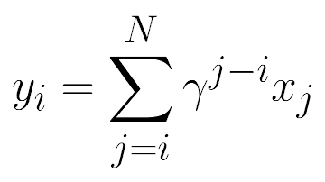
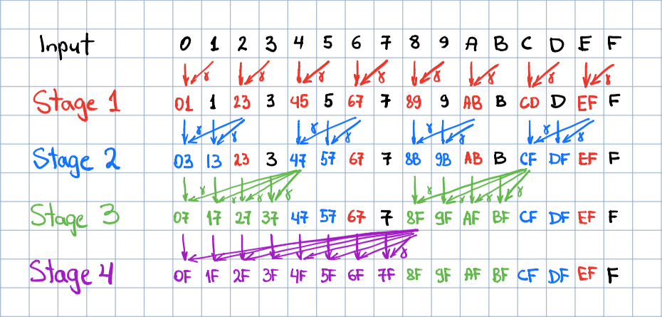

# Fast Discounted Cumulative Sums in PyTorch
[](https://pypi.org/project/torch-discounted-cumsum/)

[](https://pepy.tech/project/torch-discounted-cumsum)




This repository implements an efficient parallel algorithm for the computation of discounted cumulative sums 
and a Python package with differentiable bindings to PyTorch. The `cumsum` operation is frequently seen in data science 
domains concerned with time series, including Reinforcement Learning (RL). 

The traditional sequential algorithm performs the computation of the output elements in a loop. For an input of size 
`N`, it requires `O(N)` operations and takes `O(N)` time steps to complete. 

The proposed parallel algorithm requires a total of `O(N log N)` operations, but takes only `O(log N)` time, which is a 
considerable trade-off in many applications involving large inputs.  

Features of the parallel algorithm:
- Speed logarithmic in the input size
- Better numerical precision than sequential algorithms

Features of the package:
- CPU: sequential algorithm in C++
- GPU: parallel algorithm in CUDA
- Gradients computation wrt input
- Both left and right directions of summation supported
- PyTorch bindings

## Usage

#### Installation

```shell script
pip install torch-discounted-cumsum
```

#### API

- `discounted_cumsum_right`: Computes discounted cumulative sums to the right of each position (a standard setting in RL)
- `discounted_cumsum_left`: Computes discounted cumulative sums to the left of each position

#### Example

```python
import torch
from torch_discounted_cumsum import discounted_cumsum_right

N = 8
gamma = 0.99
x = torch.ones(1, N).cuda()
y = discounted_cumsum_right(x, gamma)

print(y)
```

Output:
```
tensor([[7.7255, 6.7935, 5.8520, 4.9010, 3.9404, 2.9701, 1.9900, 1.0000]],
       device='cuda:0')
```

#### Up to `K` elements

```python
import torch
from torch_discounted_cumsum import discounted_cumsum_right

N = 8
K = 2
gamma = 0.99
x = torch.ones(1, N).cuda()
y_inf = discounted_cumsum_right(x, gamma)
y_K = y_inf - (gamma ** K) * torch.cat((y_inf[:, K:], torch.zeros(1, K).cuda()), dim=1)   

print(y_K)
```

Output:
```
tensor([[1.9900, 1.9900, 1.9900, 1.9900, 1.9900, 1.9900, 1.9900, 1.0000]],
       device='cuda:0')
```


## Parallel Algorithm

For the sake of simplicity, the algorithm is explained for `N=16`. 
The processing is performed in-place in the input vector in `log2 N` stages. Each stage updates `N / 2` positions. Each 
stage is characterized by the size of the group of sequential elements being updated, which is computed as `2 ** stage`. 
The group stride is always twice larger than the group size. The elements updated during the stage are highlighted with 
the respective stage color in the figure below. Here input elements are denoted with their position id in hex, and 
2-symbols updated elements indicate the range of indices over which the discounted partial sum has been computed.

Each element update includes an in-place addition of a discounted element, which follows the last 
updated element in the group. The discount factor is computed as gamma raised to the power of the distance between the 
updated and the discounted elements. In the figure below, this operation is denoted with slanted arrows with a greek 
gamma tag. After the last stage finishes, the output is written in place of the input. 



In the CUDA implementation, `N / 2` CUDA threads are allocated during each stage to update the respective elements. The 
strict separation of updates into stages via separate kernel invocations guarantees stage-level synchronization and 
global consistency of updates.

The gradients wrt input can be obtained from the gradients wrt output by simply taking `cumsum` operation with the 
reversed direction of summation.

## Numerical Precision

The parallel algorithm produces a more numerically-stable output than the sequential algorithm using the same scalar 
data type.

The comparison is performed between 3 runs with identical inputs ([code](tests/test.py)). The first run casts inputs to 
double precision and obtains the output reference using the sequential algorithm. Next, we run both sequential and 
parallel algorithms with the same inputs cast to single precision and compare the results to the reference. The 
comparison is performed using the `L_inf` norm, which is just the maximum of per-element discrepancies.

With 10000-element non-zero-centered input (such as all elements are 1.0), the errors of the algorithms are 2.8e-4 
(sequential) and 9.9e-5 (parallel). With zero-centered inputs (such as standard gaussian noise), the errors are 
1.8e-5 (sequential) and 1.5e-5 (parallel).      

## Speed-up

We tested 3 implementations of the algorithm with the same 100000-element input ([code](tests/test.py)): 
1. Sequential in PyTorch (as in 
[REINFORCE](https://github.com/pytorch/examples/blob/87d9a1e/reinforcement_learning/reinforce.py#L66-L68))
2. Sequential in C++ (Intel Xeon CPU, DGX-1)
3. Parallel in CUDA (NVIDIA P-100, DGX-1)

The observed speed-ups are as follows: 
- PyTorch to C++: 387 times
- PyTorch to CUDA: 36573 times
- C++ to CUDA: 94 times

## Details on Ops-Space-Time Complexity
  
Assumptions:
- A fused operation of raising `gamma` to a power, multiplying the result by `x`, and adding `y` is counted as a 
single fused operation;
- `N` is a power of two. When it isn't, the parallel algorithm's complexity is the same as with N equal to the next 
power of two. 

Under these assumptions, the sequential algorithm takes `N` operations and `N` time steps to complete. 
The parallel algorithm takes `0.5 * N * log2 N` operations and can be completed in `log2 N` time steps
if the parallelism is unrestricted. 

Both algorithms can be performed in-place; hence their space complexity is `O(1)`.

## In Other Frameworks

#### PyTorch

As of the time of writing, PyTorch does not provide discounted `cumsum` functionality via the API. PyTorch RL code 
samples (e.g., [REINFORCE](https://github.com/pytorch/examples/blob/87d9a1e/reinforcement_learning/reinforce.py#L66-L68)) 
suggest computing returns in a loop over reward items. Since most RL algorithms do not require differentiating through 
returns, many code samples resort to using SciPy function listed below.

#### TensorFlow

TensorFlow API provides `tf.scan` API, which can be supplied with an appropriate lambda function implementing the 
formula above. Under the hood, however, `tf.scan` implement the traditional sequential algorithm.
 
#### SciPy

SciPy provides a `scipy.signal.lfilter` function for computing IIR filter response using the sequential algorithm, which 
can be used for the task at hand, as suggested in this [StackOverflow](https://stackoverflow.com/a/47971187/411907) 
response.

## Citation

To cite this repository, use the following BibTeX:

```
@misc{obukhov2021torchdiscountedcumsum,
    author = {Anton Obukhov},
    year = 2021,
    title = {Fast discounted cumulative sums in PyTorch},
    url = {www.github.com/toshas/torch-discounted-cumsum}
}
```
